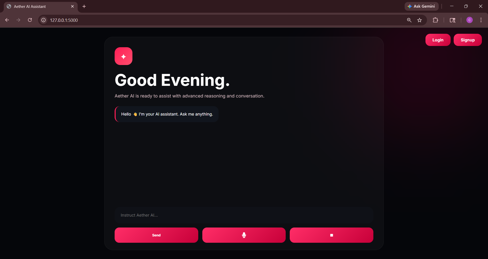
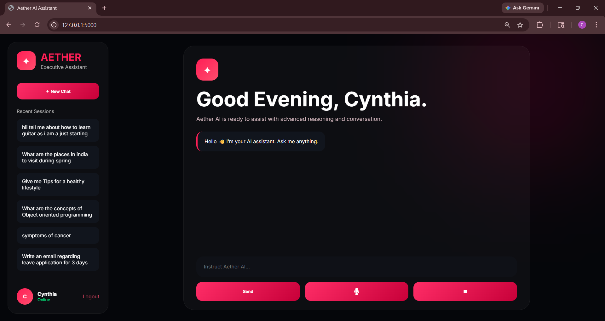
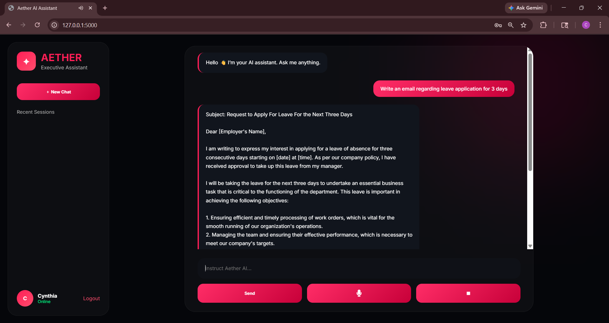

# Aether AI Assistant

Aether AI Assistant is a Flask-based AI chatbot web application with:

* AI chat assistant
* Voice input & speech output
* User authentication (Login/Signup)
* Chat history memory
* SQLite database support
* Modern responsive UI
* Ollama local AI integration

---

# Features

* AI-powered chatbot
* Speech-to-text microphone support
* Stores chat history
* Text-to-speech responses
* Login & Signup system
* Session-based chat memory
* SQLite database storage
* Modern neon UI design

## Lnading page



## Profile Page



## Chat Interface



---

# Tech Stack

## Frontend

* HTML
* CSS
* JavaScript

## Backend

* Flask
* SQLite
* Ollama
* Python

---

# Requirements

Install the following before running:

* Python 3.10+
* Ollama
* Git

---

# 1. Clone Repository

```bash
git clone https://github.com/cynthiax04/Atherai.git
```

```bash
cd Atherai
```

---

# 2. Create Virtual Environment

## Windows

```bash
python -m venv .venv
```

Activate:

```bash
.venv\Scripts\activate
```

## Mac/Linux

```bash
python3 -m venv .venv
```

Activate:

```bash
source .venv/bin/activate
```

---

# 3. Install Dependencies

```bash
pip install -r requirements.txt
```

---

# 4. Install Ollama

Download Ollama:

[https://ollama.com/download](https://ollama.com/download)

Install successfully before continuing.

---

# 5. Pull AI Model

Example using TinyLlama:

```bash
ollama pull tinyllama
```

You can also use:

```bash
ollama pull llama3
```

---

# 6. Start Ollama Server

```bash
ollama serve
```

Keep this terminal running.

---

# 7. Run Flask App

Open another terminal:

```bash
python app.py
```

---

# 8. Open in Browser

Visit:

```text
http://127.0.0.1:5000
```

---

# Project Structure

```text
Atherai/
│
├── static/
│   ├── style.css
│   └── script.js
│
├── templates/
│   ├── index.html
│   ├── login.html
│   └── signup.html
│
├── app.py
├── assistant.db
├── requirements.txt
├── vercel.json
└── README.md
```

---

# Important Notes

* Ollama must be running before starting Flask.
* The project currently works locally using Ollama.
* Cloud deployment with Ollama requires a dedicated server/VPS.

---

# Common Errors

## Ollama connection refused

Make sure:

```bash
ollama serve
```

is running.

---

## Port already in use

Kill existing Ollama process:

```bash
taskkill /F /IM ollama.exe
```

Then restart:

```bash
ollama serve
```

---

## Flask module not found

Install requirements:

```bash
pip install -r requirements.txt
```

---

# Future Improvements

* Cloud AI deployment
* Real-time streaming responses
* Voice cloning
* File uploads
* Multi-language support
* AI memory improvements

---

# Author

Cynthia Pachal

GitHub:
[https://github.com/cynthiax04](https://github.com/cynthiax04)
